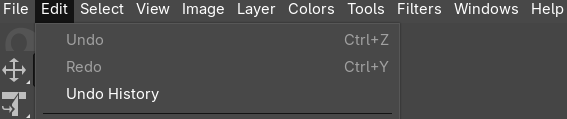
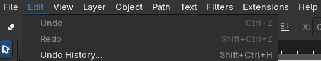
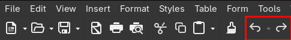
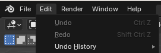
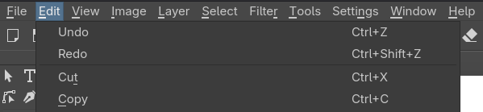
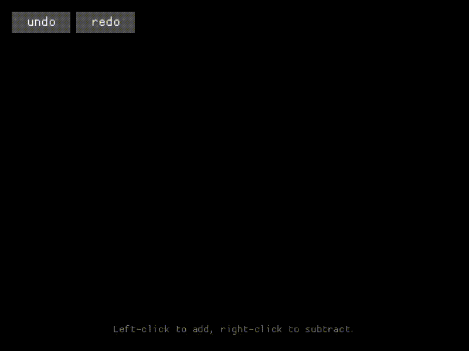
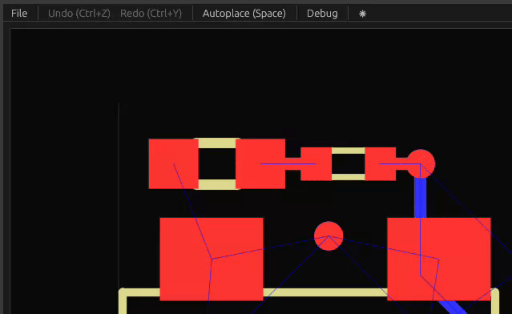
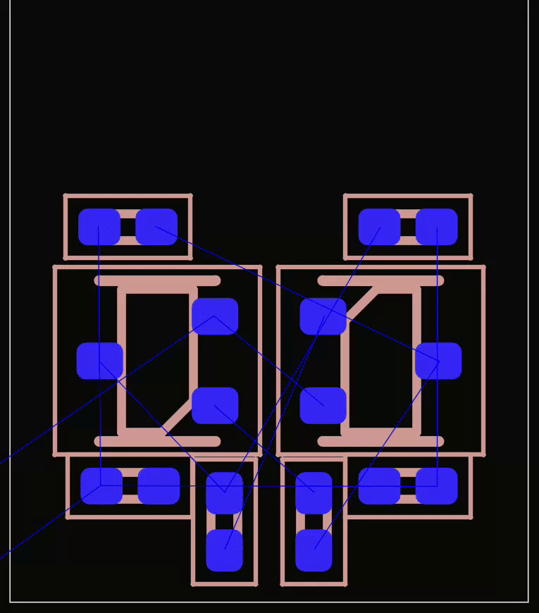

Who I am
---

<!-- pause -->

Mikołaj Wielgus

<!-- pause -->
* Engineering degree in Microelectronics in Industry and Medicine (AGH University of Science and Technology).
<!-- pause -->
* Worked in integrated circuit design company, Silicon Creations, as hardware verification engineer.
<!-- pause -->
* Was lead development team (= core team) member of KiCad EDA.
<!-- pause -->
* Currently full-time open-source software developer.
<!-- pause -->
* I develop Topola, an autoplacer and autorouter for printed circuit boards (PCB).

<!-- pause -->

Topola's website: https://topola.dev/

<!-- pause -->

What I will be presenting is a spin-off project from Topola.

<!-- end_slide -->

Introduction
---

<!-- pause -->

Undo/Redo is a design pattern that is ubiquitous in user interfaces of

<!-- pause -->
* text editors,
<!-- pause -->
* graphics editors,
<!-- pause -->
* video editors,
<!-- pause -->
* audio editors,
<!-- pause -->
* spreadsheet software,
<!-- pause -->
* Computer Aided Design (CAD) software,
<!-- pause -->
* Electronics Design Automation (EDA) software.

<!-- end_slide -->

Screenshots in the wild
---

<!-- pause -->

Undo/Redo in GIMP:

<!-- pause -->



<!-- pause -->

Undo/Redo in Inkscape:

<!-- pause -->



<!-- pause -->

Undo/Redo in LibreOffice Writer:

<!-- pause -->



<!-- pause -->

Undo/Redo in KiCad:

<!-- pause -->


<!-- end_slide -->

Screenshots in the wild (2)
---

<!-- pause -->

Undo/Redo in Blender:

<!-- pause -->



<!-- pause -->

Undo/Redo in Krita:

<!-- pause -->



<!-- pause -->

Undo/Redo in FramaCalc:

<!-- pause -->


<!-- pause -->

Undo/Redo in LibrePCB:

<!-- pause -->


<!-- end_slide -->

Introduction to `undoredo`
---

<!-- pause -->

`undoredo` is a Rust library that implements the Undo/Redo pattern in three
ways:

<!-- pause -->
* by storing commands (Command pattern);
<!-- pause -->
* by capturing snapshots (Memento pattern);
<!-- pause -->
* by automatically recording *sparse deltas* (aka. diffs, patches).

<!-- pause -->

This all works on arbitrary data structures.

<!-- pause -->

* Crates.io: https://crates.io/crates/undoredo
* Repository: https://github.com/mikwielgus/undoredo

<!-- end_slide -->

`undoredo` in action - R-treed polygons
---

<!-- pause -->

Undo-redo over polygons with R-trees using deltas:

<!-- pause -->



<!-- pause -->
* Both the polygon collection and the R-tree are delta'ed all automatically by
`undoredo`.
<!-- pause -->
* Only sparse differences between states are stored, no snapshots.
<!-- pause -->
* No application-specific undo-redo logic had to be implemented manually.

<!-- end_slide -->

Command pattern
---

<!-- pause -->

Command pattern is the most common way to perform Undo/Redo. It's conceptually
very simple.

<!-- pause -->

`undoredo` can be used for Command pattern like this:

<!-- pause -->

```rust
struct PushChar(char); // Command.
```

<!-- pause -->

```rust
use undoredo::UndoRedo; // Import undo-redo bistack.
```

<!-- pause -->

```rust
let mut string = String::new(); // String we operate on.
let mut undoredo: UndoRedo<(), PushChar> = UndoRedo::new(); // Undo-redo bistack.
```

<!-- pause -->

```rust
let cmd = PushChar('a'); // Command to perform.
string.push(cmd.0); // Perform command: push char 'a'.

undoredo.command(cmd); // Push the command to the undo-redo bistack.
```

<!-- pause -->

```rust
match undoredo.undo_command() { // Move the last done command to undone commands, return its clone.
  Some(PushChar(..)) => { string.pop(); } // Undo the push char operation.
  _ => {}
}
```

<!-- jump_to_middle -->

<!-- pause -->

```rust
match undoredo.redo_command() { // Move the last undone command to done commands, return its clone.
  Some(PushChar(c)) => string.push(c), // Perform command again: push char 'a'.
  _ => {}
}
```

<!-- end_slide -->

Disadvantages of Command pattern
---

<!-- pause -->

It is the downstream developer who has to implement the behavior of the
commands themselves.

<!-- pause -->

`undoredo` cannot automate Command pattern any more beyond providing its
undo-redo bistack, `UndoRedo`, because it has no knowledge of the underlying
logic, it only sees data.

<!-- pause -->

Command pattern is conceptually simple, but it actually results in the most
complicated code.

<!-- pause -->

If your data structure is large and complicated, code for executing commands
will be complicated as well. Because of that, it is easy to end up with elusive
bugs involving problems with determinism and consistency.

<!-- end_slide -->

Snapshots
---

<!-- pause -->

Also known as Memento pattern.

<!-- pause -->

A simpler alternative to the Command pattern. Works on anything that implements
`Clone`.

<!-- pause -->

```rust
use undoredo::Snapshot;
```

<!-- pause -->

```rust
let mut hashmap: HashMap<usize, char> = HashMap::new();
// Note use of `Snapshot<...>`
let mut undoredo: UndoRedo<Snapshot<HashMap<usize, char>>> = UndoRedo::new();
```

<!-- pause -->

When undoing using snapshots, you need to have the initial state committed:

<!-- pause -->

```rust
undoredo.commit(&mut hashmap);
```

<!-- pause -->

```rust
hashmap.insert(1, 'A');
```

<!-- pause -->

```rust
undoredo.undo(&mut hashmap);
```

<!-- pause -->

The container is now empty again after undo.

<!-- pause -->

```rust
undoredo.redo(&mut hashmap);
```

<!-- pause -->

The container now holds 'A' again after redo.

<!-- end_slide -->

Disadvantages of snapshots
---

<!-- pause -->

The total size is proportional both to data structure's size and the number
of snapshots.

<!-- pause -->

So if your data structure is large, or a large number of snapshots has been
created, you may easily run out of memory.

<!-- pause -->

100 snapshots of 10 MiB = 1 GiB of used memory

<!-- end_slide -->

Deltas
---

`undoredo` was originally developed for delta-based undo-redo. It was extended
with commands and snapshots only later.

<!-- pause -->

Delta-based undo-redo is similar to undo-redo using commands and snapshots.

<!-- pause -->

```rust
use undoredo::aliases::HashMapDelta;
```

<!-- pause -->

Initialize `HashMap` and `UndoRedo`:

<!-- pause -->

```rust
let mut hashmap: HashMap<usize, char> = HashMap::new();
let mut undoredo: UndoRedo<HashMapDelta<usize, char>>> = UndoRedo::new();
```

<!-- pause -->

Now let's insert 'A' at key 1:

<!-- pause -->

```rust
hashmap.insert(1, 'A');
```

<!-- pause -->

Now let's undo:

<!-- pause -->

```rust
undoredo.undo(&mut hashmap);
```

<!-- pause -->

The container is now empty again after undo.

<!-- pause -->

```rust
undoredo.redo(&mut hashmap);
```

<!-- pause -->

The container holds 'A' at key 1 again after redo.

<!-- end_slide -->

R-treed demo again
---

<!-- pause -->

Let's go back to the previous demo again:

<!-- pause -->


<!-- end_slide -->

Deltas on custom structs
---

<!-- pause -->

If you have your own struct, not a collection from `std` like `HashMap` or from
a supported third-party crate, to perform delta-based undo-redo on it you need
to implement undo-redo's special traits for it yourself.

<!-- pause -->

Fortunately, `undoredo` provides a derive macro for that, `derive(Delta)`.

<!-- pause -->

```rust
use undoredo::Delta;
```

<!-- pause -->

```rust
#[derive(Delta)]
pub struct RTreedPolygons {
    polygons: Vec<Vec<[i64; 2]>>,
    // R-tree with polygon ids.
    rtree: rstar::RTree<GeomWithData<Rectangle<[i64; 2]>, usize>>,
}
```

<!-- pause -->

The delta type is now called `RTreedPolygonsDelta`.

<!-- pause -->

If you instead use commands or snapshots, you don't need to do this, because
commands work on any type (but it is your job to implement them), and snapshots
work on anything that implements `Clone`.

<!-- end_slide -->

Entity-Component-System example
---

<!-- pause -->

Here's a simple example of an entity-component-system that is undoredoable using
deltas:

<!-- pause -->

```rust
#[derive(Delta)]
#[undoredo(delta = EntitiesDelta)] // You can give the delta type your own name.
pub struct Entities<T> {
    positions: Recorder<Vec<Vector2<T>>>,
    velocities: Recorder<Vec<Vector2<T>>>,
    healths: Recorder<Vec<i64>>,
    turn_counter: Recorder<u64>,
    #[undoredo(skip)] // You can skip fields.
    not_in_delta: String,
}
```

<!-- pause -->

```rust
let mut entities: Entities = Entities::new();
let mut undoredo: UndoRedo<EntitiesDelta<f64>>> = UndoRedo::new();
```

<!-- pause -->

Then entities are updated:

<!-- pause -->

```rust
entities.update();
```

<!-- pause -->

Like in previous examples, then you can just:

<!-- pause -->

```rust
undoredo.commit(&mut entities);
```

<!-- jump_to_middle -->

<!-- pause -->

```rust
undoredo.undo(&mut entities);
```

<!-- pause -->

```rust
undoredo.redo(&mut entities);
```

<!-- end_slide -->

Convenience implementations for `std`
---

<!-- pause -->

You can't do `#[derive(Delta)]` on types you don't own, so `undoredo` supplies
its own convenience implementations of deltas for `std` types:

<!-- pause -->
* `HashMap`,
<!-- pause -->
* `HashSet`,
<!-- pause -->
* `BTreeMap`,
<!-- pause -->
* `BTreeSet`
<!-- pause -->
* `Vec`.
<!-- pause -->

Example for `Vec`:

<!-- pause -->

Import delta type for `Vec`:

<!-- pause -->

```rust
use undoredo::aliases::VecDelta;
```

<!-- pause -->

Then just like previously:

<!-- pause -->

```rust
let mut vec: Vec<i64> = Vec::new();
let mut undoredo: UndoRedo<VecDelta<i64>>> = UndoRedo::new();
```

<!-- pause -->

And then you can do `.commit()`, `.undo()`, `.redo()` like in previous examples.

<!-- end_slide -->

Convenience implementations for third-party crates
---

<!-- pause -->

There are also ready feature-gated implementations of deltas for types from
third-party crates:

<!-- pause -->
* `BiHashMap` and `BiBTreeMap` from `bidimap` crate (bidirectional maps from maintained fork of `bimap`),
<!-- pause -->
* `RTree` from `rstar` crate (R-tree for spatial access);
<!-- pause -->
* `StableVec` from `stable-vec` crate (basically, `Vec` without index invalidation on remove);
<!-- pause -->
* `Arena` from `thunderdome` crate.

<!-- end_slide -->

Electronic Design Automation
---

<!-- pause -->

Delta-based undo-redo of moving with mouse drag:

<!-- pause -->



<!-- pause -->

This is done using `undoredo`'s deltas.

<!-- end_slide -->

Simulated Annealing
---

<!-- pause -->

Simulated annealing is a probabilistic algorithm often used for automatic
placement of components on a PCB layout.

<!-- pause -->

Finding maximum in one dimension using with simulated annealing:

<!-- pause -->


<!-- end_slide -->

Simulated Annealing (2)
---

<!-- pause -->

Simulated annealing's principle of operation is this:

<!-- pause -->
* Start with initial solution.
<!-- pause -->
* Repeatedly propose small modifications.
<!-- pause -->
* If a proposed solution is better, accept immediately.
<!-- pause -->
* If it is worse, accept it with a certain probability, otherwise reject.
<!-- pause -->
* Usually P(accept) = exp(-Δcost/T).
<!-- pause -->
* Δcost is the change in cost of the proposed solution.
<!-- pause -->
* T is temperature.
<!-- pause -->
* Initially T is high to encourage *exploration*.
<!-- pause -->
* Later T decreases, making rejection more likely, encouraging *exploitation*.

<!-- end_slide -->

Simulated Annealing (3)
---

<!-- pause -->

`undoredo` has a feature useful in simulated annealing: you can call
`.reset_delta()` on any recorder or anything that had `Delta` derived to reset
the delta that is currently being recorded.

<!-- pause -->

Doing so restores the state to the moment of the latest commit
(basically `git reset --hard`).

<!-- pause -->

This can be used to reject candidate states without having to create any more
complicated logic.

<!-- pause -->

```rust
while temperature > MIN_TEMPERATURE {
    let old_cost = state.cost();

    state.random_step();

    let delta_cost = state.cost() - old_cost;
    
    if delta_cost >= 0.0 && random(0, 1) < (-delta_cost - temperature).exp() {
        // `undoredo` is used here!
        // Worse state is rejected by calling `.reset_delta()`.
        state.reset_delta();
    }

    temperature *= COOLDOWN_RATE;
}
```

<!-- end_slide -->



<!-- end_slide -->

Future plans
---

<!-- pause -->
* Undo-redo over databases: integration with `diesel`, `sled`.
<!-- pause -->
* Non-linear history -- tree instead of bistack.
<!-- pause -->
* Temporary, non-persistent history in cyclic buffer.

<!-- end_slide -->

The end
---

Thanks for watching!

* Repository: https://github.com/mikwielgus/undoredo
* Crates.io: https://crates.io/crates/undoredo
* Presentation: https://github.com/mikwielgus/rustmeet2026-undoredo
* Topola: https://topola.dev/
